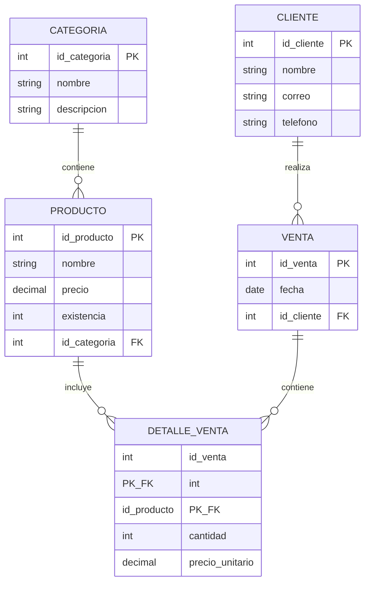

# Taller práctico — Claves, Restricciones y Modelo Entidad-Relación en MySQL

**Caso:** base de datos de una tienda de ropa · **Solución aplicando 3FN**

## Reto 1 · Entidades y atributos

| Entidad | Atributos |
|---|---|
| Categoria | id_categoria, nombre, descripcion |
| Producto | id_producto, nombre, precio, existencia, id_categoria |
| Cliente | id_cliente, nombre, correo, telefono |
| Venta | id_venta, fecha, id_cliente |
| Detalle_venta | id_venta, id_producto, cantidad, precio_unitario |

> `Detalle_venta` resuelve la relación N:M entre Producto y Venta; incluye `precio_unitario` para conservar el precio vigente al momento de la venta.

## Reto 2 · Claves primarias y foráneas

| Entidad | Clave primaria (PK) | Clave foránea (FK) |
|---|---|---|
| Categoria | id_categoria | — |
| Producto | id_producto | id_categoria → Categoria(id_categoria) |
| Cliente | id_cliente | — |
| Venta | id_venta | id_cliente → Cliente(id_cliente) |
| Detalle_venta | (id_venta, id_producto) | id_venta → Venta(id_venta)<br>id_producto → Producto(id_producto) |

## Reto 3 · CREATE TABLE con restricciones

```sql
CREATE TABLE categoria (
    id_categoria INT AUTO_INCREMENT PRIMARY KEY,
    nombre       VARCHAR(50)  NOT NULL,
    descripcion  VARCHAR(150)
);

CREATE TABLE producto (
    id_producto   INT AUTO_INCREMENT PRIMARY KEY,
    nombre        VARCHAR(100)   NOT NULL,
    precio        DECIMAL(10,2)  NOT NULL CHECK (precio >= 0),
    existencia    INT            NOT NULL DEFAULT 0 CHECK (existencia >= 0),
    id_categoria  INT            NOT NULL,
    FOREIGN KEY (id_categoria) REFERENCES categoria(id_categoria)
);

CREATE TABLE cliente (
    id_cliente INT AUTO_INCREMENT PRIMARY KEY,
    nombre     VARCHAR(100) NOT NULL,
    correo     VARCHAR(100) NOT NULL UNIQUE,
    telefono   VARCHAR(20)
);

CREATE TABLE venta (
    id_venta   INT AUTO_INCREMENT PRIMARY KEY,
    fecha      DATE NOT NULL DEFAULT (CURRENT_DATE),
    id_cliente INT  NOT NULL,
    FOREIGN KEY (id_cliente) REFERENCES cliente(id_cliente)
);

CREATE TABLE detalle_venta (
    id_venta        INT NOT NULL,
    id_producto      INT NOT NULL,
    cantidad         INT NOT NULL CHECK (cantidad > 0),
    precio_unitario  DECIMAL(10,2) NOT NULL CHECK (precio_unitario >= 0),
    PRIMARY KEY (id_venta, id_producto),
    FOREIGN KEY (id_venta) REFERENCES venta(id_venta),
    FOREIGN KEY (id_producto) REFERENCES producto(id_producto)
);
```

## Reto 4 · Diagrama Entidad-Relación



> PK: clave primaria · FK: clave foránea · el diagrama se renderiza automáticamente en GitHub (soporte nativo de Mermaid).

## Cumplimiento de 3FN

- **1FN:** todos los atributos son atómicos; no hay grupos repetidos.
- **2FN:** en `detalle_venta` (clave compuesta), `cantidad` y `precio_unitario` dependen de la clave completa, no de una parte.
- **3FN:** no hay dependencias transitivas — `categoria` se separó de `producto`, y los datos de cliente no se repiten en `venta`.
